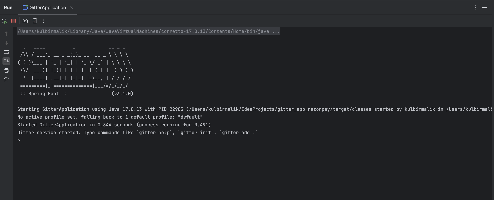
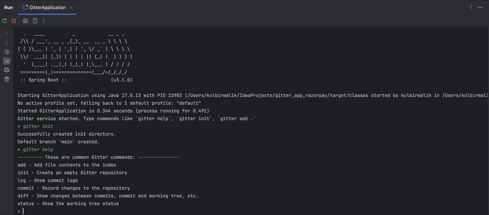
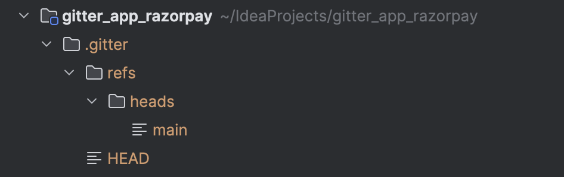
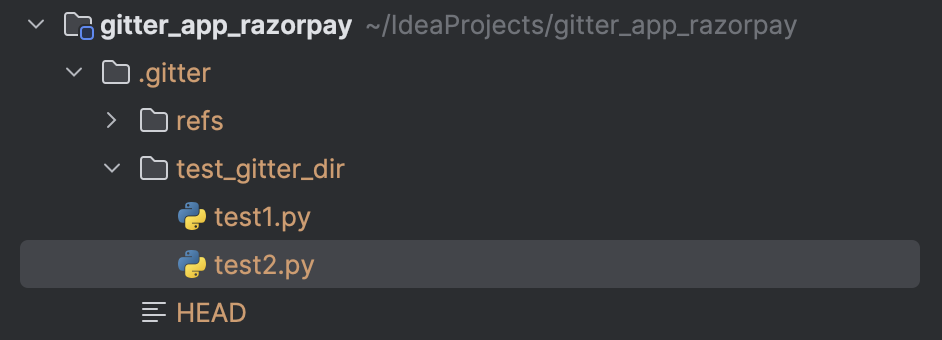
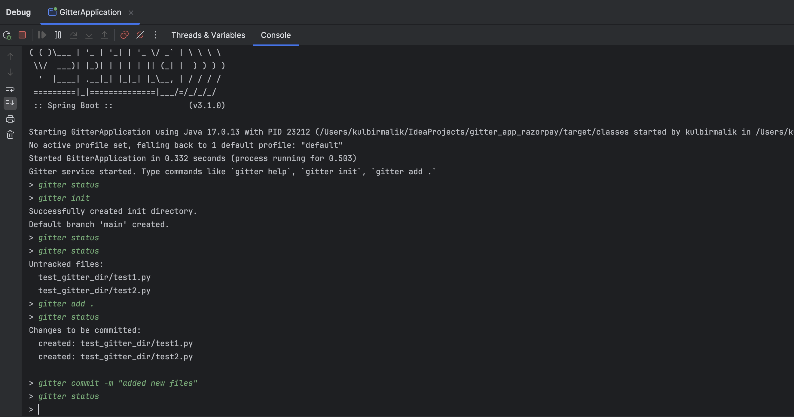
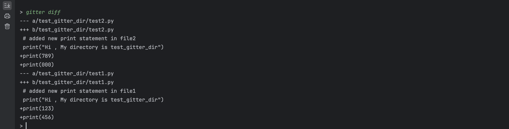
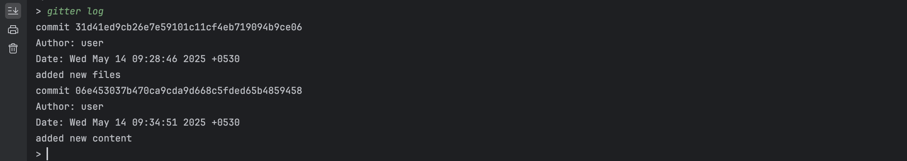

# **GitterApplication**

GitterApp is a Spring Boot-based application designed to manage file staging, commit history, and diffs in a Git-like in-memory repository. It provides a CLI-style interface for interacting with staged files and committed changes, mimicking basic Git operations like `add`, `commit`, `diff`, `status`, and more.

---

## ✅ **Features**

- **Git-like file staging** (`CommandAddService`) – Stage and unstage files using pattern matching.
- **Commit management** (`CommandCommitService`) – Commit staged changes to an in-memory store.
- **Diff viewing** (`CommandDiffService`) – Compare file states between current and committed versions.
- **Helper utilities** (`CommandHelperService`) – Utility support for file management and processing.
- **Repository initialization** (`CommandInitService`) – Initialize a new Gitter workspace.
- **Commit logs** (`CommandLogService`) – View historical commits and their metadata.
- **File status display** (`CommandStatusService`) – Show current file statuses (staged, modified, untracked).

---

## 🛠 **Prerequisites**

Ensure the following tools are installed:

- **Java 17** or later
- **Maven** (for dependency management)
- An IDE like IntelliJ IDEA or Eclipse (optional, for development)

---

## 🚀 **Installation**

1. **Clone the repository**  
   Clone the repository to your local machine using the following command:
   ```bash
   git clone https://github.com/yourusername/gitterApp.git
   cd gitterApp


2. **Install dependencies**
   ```bash
   mvn install

3. **Set the environment**
   Ensure Java 17+ is set in your environment:
   ```bash
   java -version

4. **Build the application**
   ```bash
   mvn clean install

5. **▶️Running the Application**
   This starts the GitterApp backend on the default port (typically http://localhost:8080).
   ```bash
   mvn spring-boot:run
   

6. **🧪Running Tests**
   ```bash
   mvn test

---

## 🧪 **Test Coverage**

The repository has unit tests covering **approximately 80%** of the codebase.

---
 **📦 Available Commands**
1. gitter init – Initializes the Gitter workspace.
2. gitter add <file-or-pattern> – Stages specified files.
3. gitter status – Displays the current file status.
4. gitter commit -m "<message>" – Commits staged changes with a message.
5. gitter diff [<file-or-path>] – Shows file differences (optionally filtered).
6. gitter log – Lists commit history.

---
**▶️ Working Demo**








**📚 Adding New Files**







